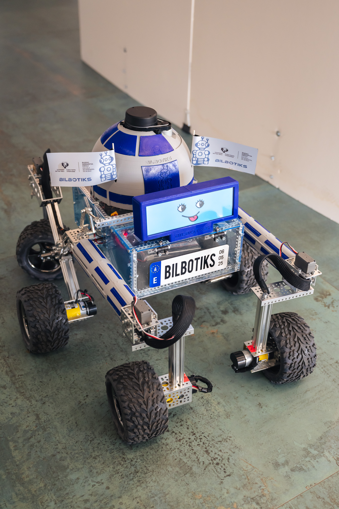
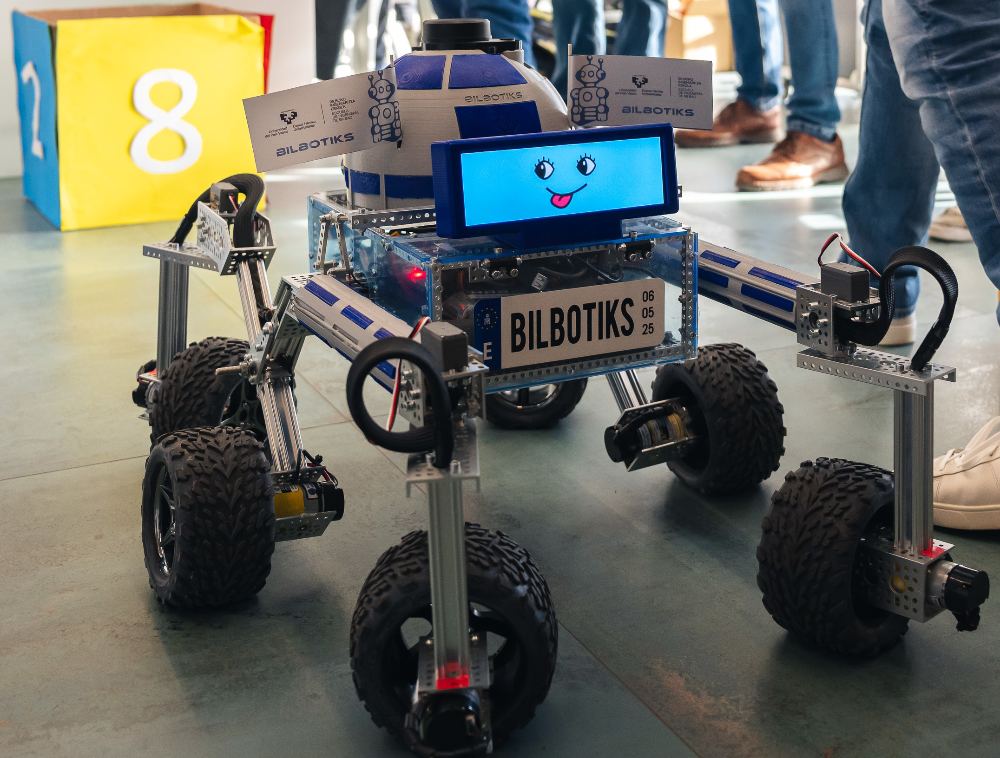
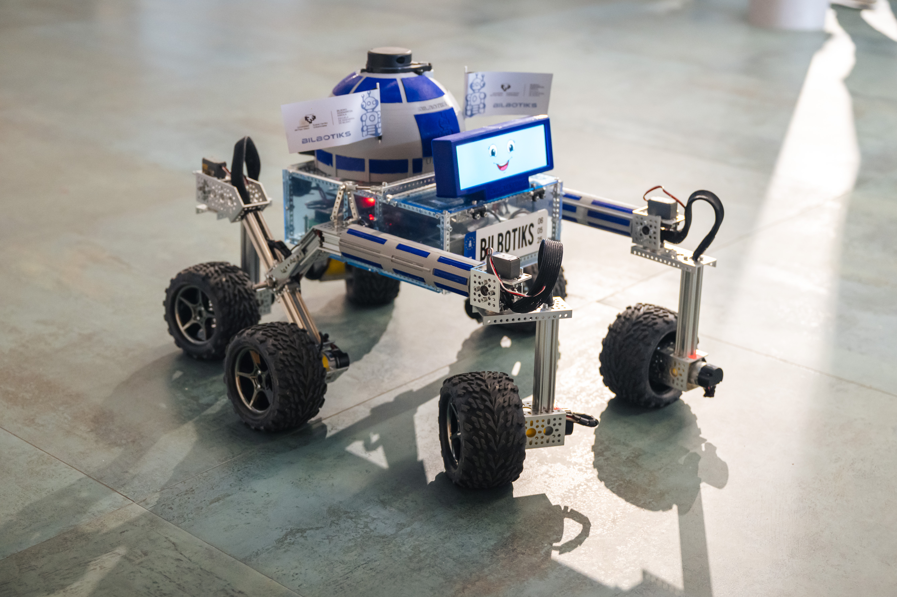
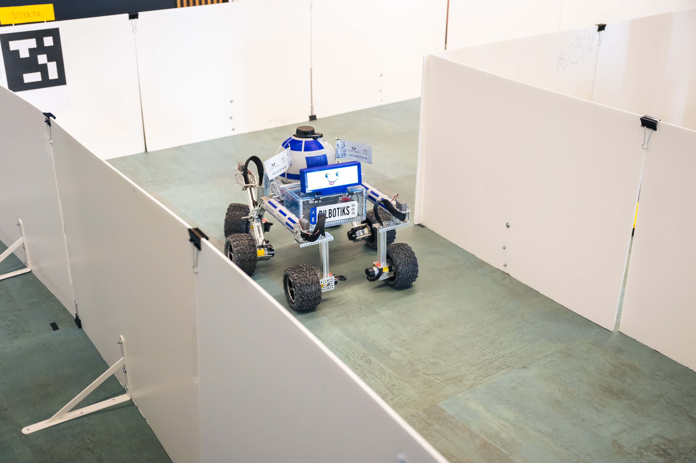

# TFG: Desarrollo de algoritmos de percepción y control en ROS2 para robótica móvil
- Autor: Javier Arambarri Calvo
- Directora: Itziar Cabanes Axpe
- Codirector: Unai López Novoa
- Grado: Ingeniería Informática de Gestión y Sistemas de Información
- Universidad: Escuela de Ingeniería de Bilbao - Universidad del País Vasco (UPV/EHU)
- Curso: 2024-2025

Este repositorio recoge el Trabajo de Fin de Grado "Desarrollo de algoritmos de percepción y control en ROS2 para robótica móvil", que obtuvo una calificación de 10 y Matrícula de Honor y el 1º Premio del eje Prosperidad en el VIII. Congreso de Estudiantes de la Universidad del País Vasco (UPV / EHU).

En el directorio principal encontramos:
- ``memoria.pdf``: memoria del TFG.
- ``defensa.pdf``: presentación defensa del TFG.
- ``presentacion_ehuKongresua.pdf``: presentación PDF en el VIII. Congreso de Estudiantes de la EHU.
- ``presentacion_ehuKongresua.mp4``: presentación en vídeo en el VIII. Congreso de Estudiantes de la EHU.
- ``poster_ehuKongresua.pdf``: póster en el VIII. Congreso de Estudiantes de la EHU.
- ``premio_ehuKongresua.pdf``: certificado del 1º Premio en el VIII. Congreso de Estudiantes de la EHU.
- ``lightningTalk_ROSConEs25.pdf``: presentación de la lightning talk expuesta en la ROSConEs 2025 en Barcelona el 5 de noviembre de 2025.
- ``presentacion_hackathonNvidiaLeRobot.pdf``: presentación del TFG en el Hackathon NVIDIA Le Robot celebrado en Bilbao los días 21-23 de noviembre de 2025.
- ``bilbotiks_ws/``: workspace de ROS2 de los algoritmos desarrollados.
- ``sim_gazeboHarmonic/``: imagen Docker personalizada y workspace de ROS2 para la simulación.
- ``matlab/``: código MATLAB y origen de los datos para la generación de los gráficos de la memoria.
- ``docs/``: documentación generada no incluida en la memoria.
- ``otros/``: otros ficheros de interés.

## Contacto
- Mail: javierarambarricalvo@gmail.com
- Redes: [https://linktr.ee/arambarricalvoj](https://linktr.ee/arambarricalvoj)

## Fotos y vídeos
Fotos y vídeos disponibles en la carpeta ``.images/``.
 

  

  

  

  

