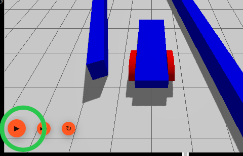

# sim_gazeboHarmonic/
Este directorio contiene los ficheros necesarios para ejecutar la simulación de la sección 7.9 de la memoria.

Pasos a seguir:
## 1. Descargar la imagen Docker (se asumen Docker instalado).
La imagen docker de ROS2 Jazzy Jalisco con Gazebo Harmonic se encuentra publicada en: [https://hub.docker.com/r/arambarricalvoj/ros2-jazzy-gazebo-harmonic](https://hub.docker.com/r/arambarricalvoj/ros2-jazzy-gazebo-harmonic).

Para descargarla:
```bash
docker pull arambarricalvoj/ros2-jazzy-gazebo-harmonic:latest
```

## 2. Ejecutar instancia de la imagen.
Es necesario compartir:
- sistema o protocolo de visualización y redes X11 para poder abrir la interfaz gráfica de Gazebo Harmonic mientras se ejecuta en un contenedor de Docker: 

``-e DISPLAY=$DISPLAY \
           -v /tmp/.X11-unix/:/tmp/.X11-unix/ \``

- directorio de trabajo con los ficheros de la simulación:

``-v ./sim_gazeboHarmonic_ws:/home/$USER/sim_gazeboHarmonic_ws/``
           
- tarjetas gráficas o gpus:

``--gpus all``

Además, para acceder al contenedor desde terminal hay que arrancarlo con el flag ``-it``.

Por tanto, para facilitar el arranque se ha definido el fichero bash ``run.sh`` que incluye toda esa configuración. Es suficiente con ejecutarlo:
```bash
./run.sh
```

Por último, en otra terminal, acceder al contenedor en ejecución:
```bash
docker exec -it ros2_jazzy_gz_harmonic bash 
```

## 3. Compilar y activar workspace
```bash
cd /home/$USER/sim_gazeboHarmonic_ws
```

```bash
colcon build && source install/setup.bash
```

## 4. Ejecutar mundo y simulación en Gazebo Harmonic
En una terminal:
```bash
cd /home/$USER/sim_gazeboHarmonic_ws/src/corridor/src && gz sim corridor_follow_robot.sdf
```
```bash
gz sim corridor_follow_robot.sdf
```

En la otra terminal:
```bash
ros2 run laberinto corridor_follow
```

En la interfaz gráfica de Gazebo Harmonic, pulsar el play en el botón naranja de la esquina inferior izquierda:

<!--  -->

<div align="center">
  
</div>


## Vídeo
En ``.images/video_gz.webm``.